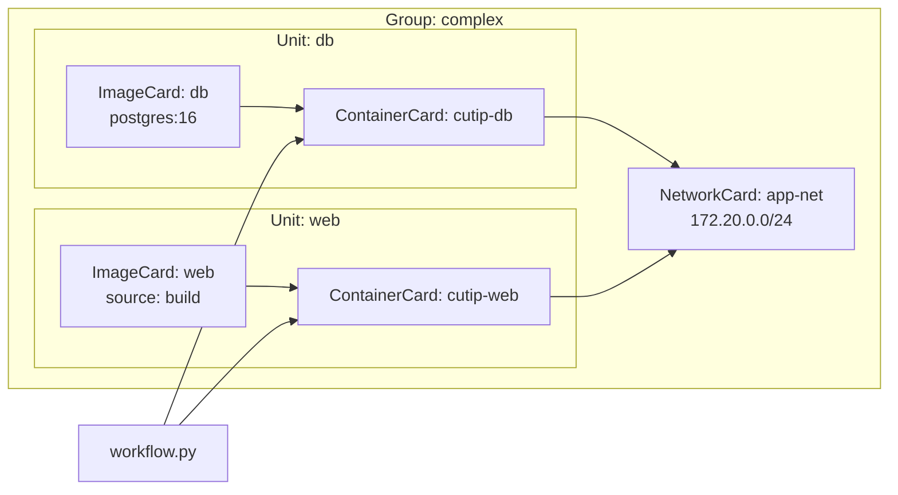
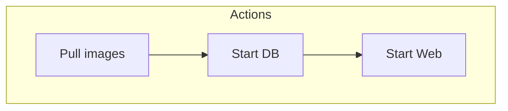

# Reference: `cutip compile` (Planned)

> [!NOTE]
> `cutip compile` is a planned feature. This page documents the intended design and output format. The command is not yet available in the current release.

---

## Purpose

`cutip compile` will analyze a workspace and produce a visual representation of the artifact graph as a Mermaid diagram. This gives teams a single command to generate up-to-date architecture diagrams from their YAML artifacts --- no manual diagramming, no stale documentation.

---

## Planned usage

```shell
cutip compile [--format mermaid|json] [--output FILE] [--path PATH]
```

| Flag | Default | Description |
|---|---|---|
| `--format / -f` | `mermaid` | Output format: `mermaid` for Mermaid markup, `json` for machine-readable graph |
| `--output / -o` | stdout | Write output to a file instead of stdout |
| `--path / -p` | git root / cwd | Override project root |

---

## Planned output: Mermaid

For a workspace with a `complex` group containing `db` and `web` units:

```shell
cutip compile
```

Expected output:



This Mermaid output can be:

- Pasted directly into GitHub Markdown (rendered natively)
- Included in MkDocs documentation (with the `pymdownx.superfences` Mermaid integration)
- Rendered locally with the [Mermaid CLI](https://github.com/mermaid-js/mermaid-cli)

---

## Planned output: JSON

```shell
cutip compile --format json
```

Expected output:

```json
{
  "groups": [
    {
      "name": "complex",
      "workflow": "cutip/groups/complex/workflow.py",
      "units": [
        {
          "name": "db",
          "container_card": "containers/cutip-db",
          "image_card": "images/db",
          "network_card": "networks/app-net"
        },
        {
          "name": "web",
          "container_card": "containers/cutip-web",
          "image_card": "images/web",
          "network_card": "networks/app-net"
        }
      ]
    }
  ]
}
```

The JSON format is intended for consumption by CI pipelines, custom visualization tools, or any system that needs a machine-readable view of the workspace graph.

---

## Relationship to `cutip validate` and `cutip plan`

| Command | Purpose | Backend required |
|---|---|---|
| `cutip validate` | Check graph integrity (refs, schema, workflow files) | No |
| `cutip plan` | Show execution steps as a table | No |
| `cutip compile` | Produce a visual graph of the artifact relationships | No |

All three commands operate on the static artifact graph. None contact a container runtime. `compile` differs from `plan` in that it shows the structural relationships between artifacts (which card references which), while `plan` shows the runtime execution sequence (which operations will run in what order).

---

## Action graph integration

When workflows use `@action` and `@orchestrator` decorators, `cutip compile` will include the action execution graph alongside the artifact graph:



This is extracted via AST analysis (the same introspection used internally by `cutip.workflow.introspect`) and does not require importing or executing the workflow.
